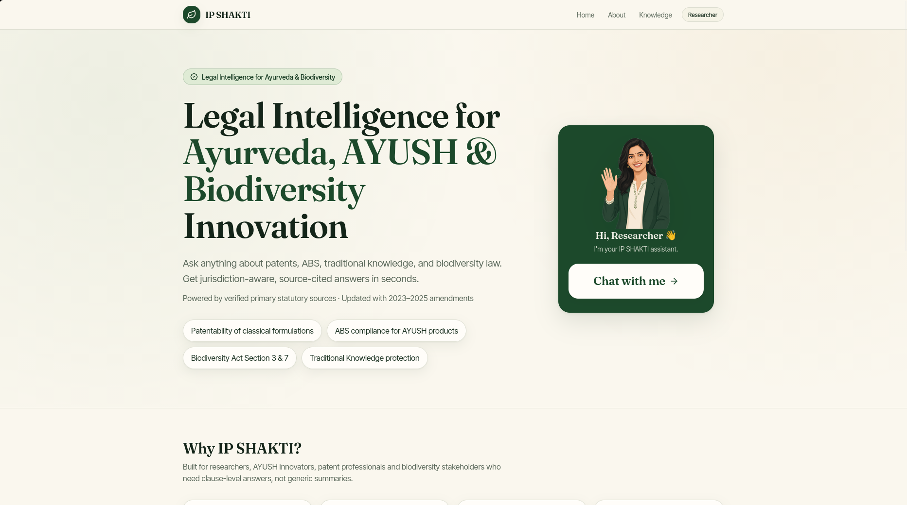
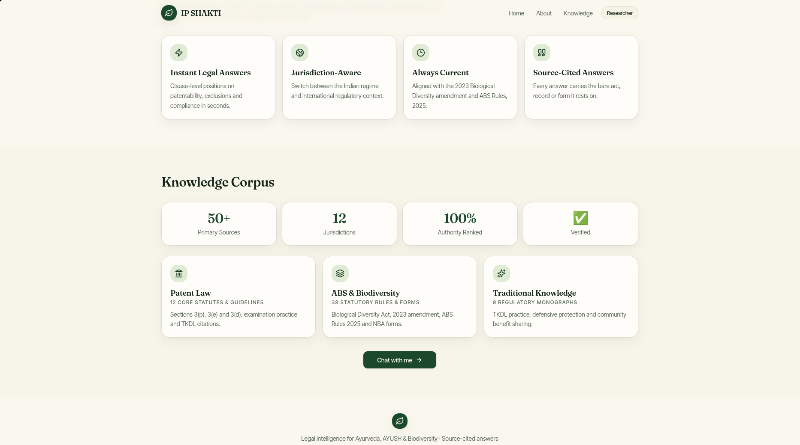
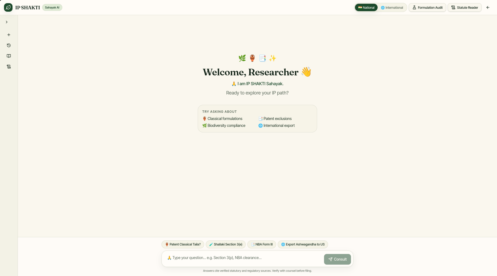
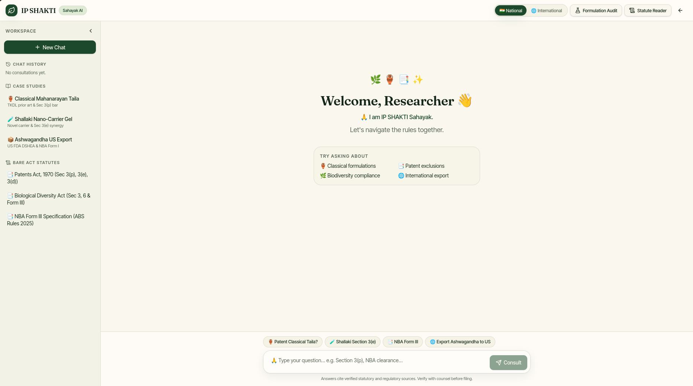

# Screenshots & UI Walkthrough — IP-SAKTI Sahayak (SIH-26045)

### 1. Landing Page & Assistant Greeting (`01_landing_hero.png`)
*Hero section with assistant greeting, quick query topic pills, and introductory call-to-action.*

---

### 2. Multi-Statutory Knowledge Corpus Overview (`02_knowledge_corpus.png`)
*Key metrics and domain-specific knowledge corpus covering Patent Law, ABS & Biodiversity, and Traditional Knowledge.*

---

### 3. Interactive Legal Chat Workspace (`03_chat_workspace_view.png`)
*Full chat canvas featuring National/International jurisdiction toggles, Formulation Audit and Statute Reader drawer triggers, and contextual prompt chips.*

---

### 4. Researcher Workspace with Multi-Turn Sidebar (`04_researcher_workspace_sidebar.png`)
*Sidebar showing case studies (Classical Mahanarayan Taila, Shallaki Nano-Carrier Gel, Ashwagandha Export) and live Bare Act quick links.*

