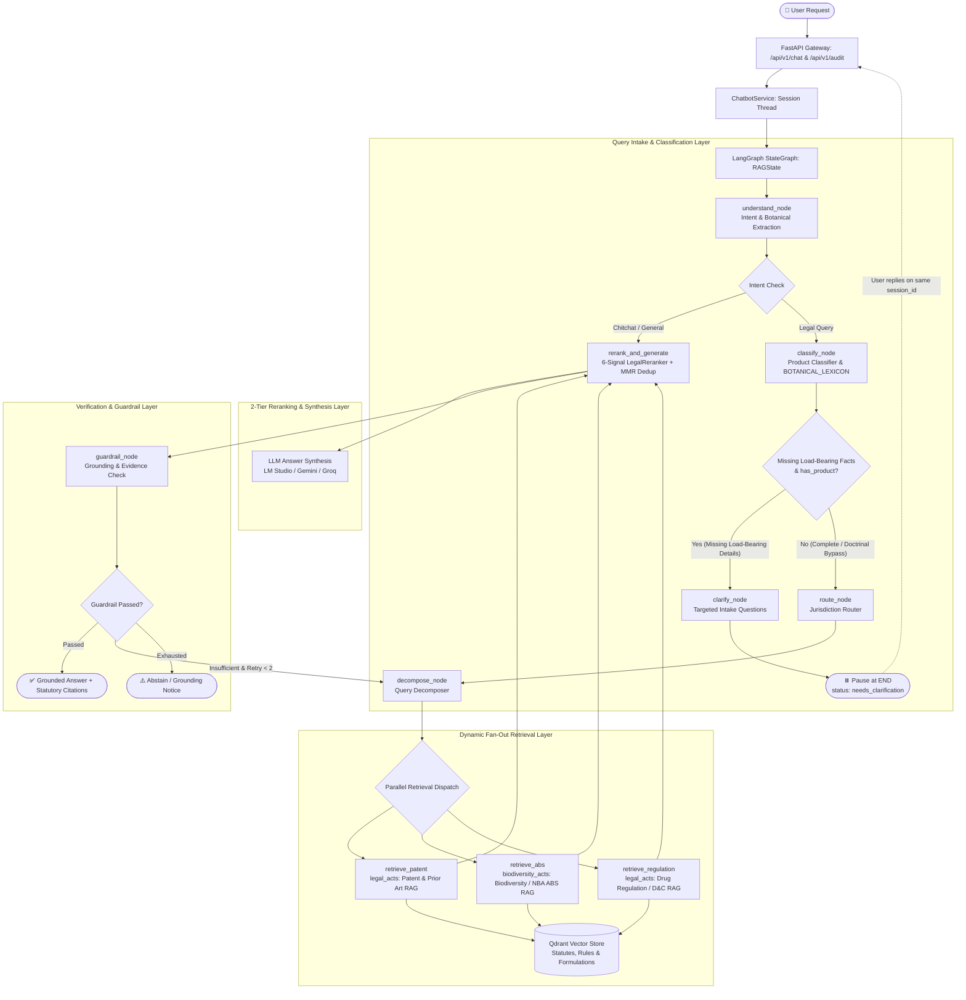

# IP-SAKTI Legal RAG Backend 🌿⚖️

An enterprise-grade, agentic Legal Retrieval-Augmented Generation (RAG) backend specifically engineered for the **Ayurvedic, Phytopharmaceutical, and Indian Intellectual Property regulatory ecosystem**.

Built with **FastAPI**, **LangGraph (Cyclical StateGraph)**, **Qdrant Vector Database**, and a custom **6-Signal Multi-Criteria Legal Reranker Engine**.

---

## 🏛️ System Architecture

The backend implements an autonomous, stateful multi-agent workflow that understands legal intent, categorizes formulations, dynamically fans out retrieval across distinct legal codices, reranks candidates via domain-specific statutory heuristics, and guarantees groundedness before responding.



> 📖 **Deep Dive Documentation:** For complete mathematical formulas, node transitions, and component explanations, see [`backend_details_explained.md`](backend_details_explained.md).

---

## 🌟 Key Technical Innovations

1. **Stateful LangGraph Checkpointing**: Multi-turn conversation state is maintained using `MemorySaver`. Context boundaries and retry counts reset cleanly across turns.
2. **Ayurvedic Statutory Classification**: Automatically categorizes products across 6 legal categories (*Classical TKDL, Proprietary, Phytopharmaceutical, Non-Classical, Ayurveda Aahar, Cosmetic*).
3. **Decoupled Botanical Extraction (`BOTANICAL_LEXICON`)**: Instantly resolves Ayurvedic herbs (Ashwagandha, Shallaki, Curcumin, Neem, Tulsi, Triphala, Brahmi, Guggulu, etc.) and runs extraction independently of category heuristic matches.
4. **Structural Slot-Filling Gating**: Gated on `has_product` presence in `raw_product_description`. Pure doctrinal questions (*"Does prior use in classical texts count as prior art?"*) bypass clarification without fragile keyword lists.
5. **Dynamic Fan-Out Retrieval**: Uses LangGraph's dynamic `Send` API to dispatch sub-queries in parallel to specialized retrieval domains (*Patents, Biological Diversity Act / ABS, Drugs & Cosmetics Act*).
6. **6-Signal Multi-Criteria Legal Reranker Engine (`LegalReranker`)**:
   $$\text{Composite Score} = 0.35 s_{\text{rel}} + 0.20 s_{\text{auth}} + 0.15 s_{\text{app}} + 0.15 s_{\text{fresh}} + 0.10 s_{\text{jur}} + 0.05 s_{\text{cit}} + \text{Hard Boosts}$$
   - **Exact Citation Boost (+0.25)**: Decisive boost when a query explicitly cites a provision (e.g. *Section 3(p)*, *Rule 158B*).
   - **MMR Provision Deduplication**: Prevents top-$k$ flooding from identical provisions.
7. **Formulation Audit Pre-Screening (`/api/v1/audit`)**:
   - Qualitative banded verdicts (*Likely Blocked*, *Borderline — Needs Evidence*, *Reasonably Viable*).
   - Reuses multi-domain RAG retrieval and reranking for 100% parity with Chat.
   - Defensive JSON parsing floor prevents 500 crashes on malformed LLM outputs.
8. **Cyclical Self-Correction Loop**: If retrieved evidence fails grounding thresholds, the graph automatically loops back to decompose and re-retrieve up to 2 times before gracefully abstaining.

---

## 📁 Repository Structure

```
code/backend/
├── .env.example                     # Environment template
├── backend_details_explained.md     # In-depth architectural guide
├── README.md                        # Backend documentation & quickstart
├── test_clarification_and_reranker.py # 12-test automated regression suite
└── app/
    ├── __init__.py                  # Ingestion path resolution & package setup
    ├── config.py                    # Pydantic Settings
    ├── main.py                      # FastAPI application entry point & CORS
    ├── api/routes/
    │   ├── chat.py                  # POST /api/v1/chat (conversational RAG)
    │   ├── audit.py                 # POST /api/v1/audit (formulation audit)
    │   └── health.py                # GET /api/v1/health (health check)
    ├── core/                        # Domain intelligence (classifier, decomposer, router)
    ├── graph/                       # LangGraph StateGraph (builder, state, edges, nodes)
    ├── retrieval/                   # Qdrant hybrid retrieval & LegalReranker engine
    ├── generation/                  # Evidence pack synthesis & LLM answerer
    ├── guardrails/                  # Output grounding & sufficiency checks
    ├── llm/                         # Model providers & domain system prompts
    ├── models/                      # Pydantic data schemas
    └── services/                    # Memory, reranking, chatbot service
```

---

## 🚀 Running the Backend

### 1. Environment Setup

Create `.env` in `code/backend/`:

```env
LLM_PROVIDER=lm_studio
LM_STUDIO_BASE_URL=http://127.0.0.1:1234/v1
LM_STUDIO_MODEL=qwen/qwen3-4b-2507

QDRANT_URL=https://82d290b7-7de1-406c-a36e-4907be77f49a.eu-west-2-0.aws.cloud.qdrant.io
QDRANT_API_KEY=your_qdrant_api_key

BACKEND_HOST=0.0.0.0
BACKEND_PORT=8001
CORS_ORIGINS=http://localhost:5173,http://localhost:3000
```

### 2. Start the Server

```bash
cd code/backend
source ../../.venv/bin/activate
uvicorn app.main:app --host 0.0.0.0 --port 8001 --reload
```

Interactive OpenAPI docs: `http://localhost:8001/docs`

---

## 🧪 Automated Testing

Run the 12-case regression suite covering all graph branches, clarification gating, and audit endpoints:

```bash
cd code/backend
source ../../.venv/bin/activate
python test_clarification_and_reranker.py
```

Expected output:
```
=================================================================
ALL 12 TEST CASES PASSED SUCCESSFULLY!
=================================================================
```
